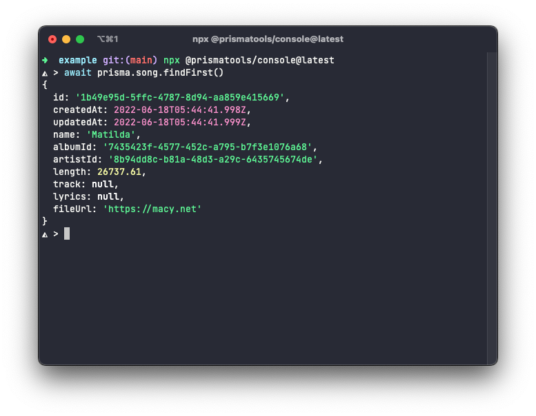
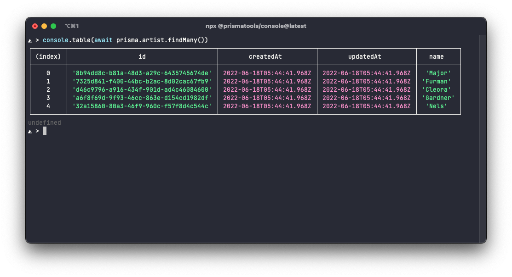

# prisma-console

Run Prisma Queries in a REPL style console. Heavily inspired by the Rails Console

## Screenshot



### Forget Prisma Studio! 🤣



## Usage

- Install dependencies

```sh
npm i pretty-repl
```

- Copy the code in [`app.js`](./app.js) to a desired file in your exsisting project
- **[OPTIONAL]** Configure the prisma client in your own way
- Add a script in your `package.json` file.
  - Remember to use the `--experimental-repl-await` flag to support `await` syntax in the REPL console
  - Dont forget to correctly set the file in place of `./app.js`

```diff
  "main": "app.js",
  "scripts": {
    "test": "echo \"Error: no test specified\" && exit 1",
+   "console": "node --experimental-repl-await ./app.js"
  },
  "author": "Kinjal Raykarmakar",
```

- Run the console!

```sh
npm run console
```
